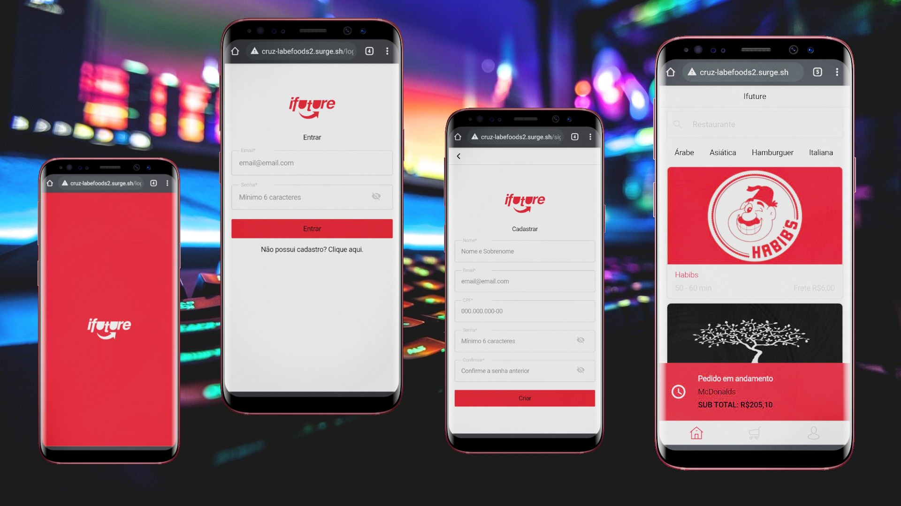

LABE-FOODS2

<h3 align="center">TABELA DE CONTEÚDOS

 <a href="#objetivo">Objetivo</a> •
 <a href="#Pré-Requisitos">Pré-Requisitos</a> • 
 <a href="#tecnologias">Tecnologias</a> • 
 <a href="#aplicação">Aplicação</a> • 
 <a href="#contribuição">Contribuição</a> • 
 <a href="#Screenshot">Screenshot</a> • 

</h3>
  

<h3 align="center">PROJETO EM FASE FINAL</h2>

<h1 align="center">iFuture</h1>

### Objetivo

Este é o projeto final do módulo de Frontend do curso de Web Fullstack da LABENU. Nosso objetivo é desenvolver um aplicativo de fast-food, com todas as funções necessárias para que o mesmo seja capaz de cadastrar e reconhecer um usuário logado, checar o seu histórico de pedidos e o mais importante, conseguir efetuar a compra da refeição e acompanhar o tempo do pedido em questão.

  
### Pré-requisitos

Antes de começar, você precisa ter instalado em sua máquina: [Git](https://gitforwindows.org/), [Node.js](https://nodejs.org/en/), [Postman](https://www.postman.com/).
Além disso, você precisa ter um bom editor de código, como [VSCode](https://code.visualstudio.com/).

### Tecnologias

As seguintes tecnologias foram utilizadas no projeto:

- [Node.js](https://nodejs.org/en/)
- [React](https://pt-br.reactjs.org/)
- [Material-UI](https://material-ui.com/pt/)
- [Axios](https://www.npmjs.com/package/axios)
- [styled-components](https://styled-components.com/)
- [React-router-dom](https://reactrouter.com/web/guides/quick-start)
- [Zeplin](https://zeplin.io/)

### Aplicação

-Link Surge: http://cruz-labefoods2.surge.sh/

-Link da API: https://documenter.getpostman.com/view/7549981/SWTEdGtT

### Contribuição

Este projeto contou com a contribuição de:

<ul>
 <li><a href="https://www.linkedin.com/in/andr%C3%A9-muniz-26559510a/">André Muniz</a></li>
 <li><a href="https://www.linkedin.com/in/igor-meira-55422a1b5/">Igor Meira do Nascimento Silva</a> </li>
 <li><a href="https://www.linkedin.com/in/janayllafirmino/">Janaylla Firmino</a></li>
 <li><a href="https://www.linkedin.com/in/jose-isaac/">José Isaac Barreiro Campos</a></li>
 <li><a href="https://www.linkedin.com/in/kelvia-kelline/">Kelvia Kelline dos Santos Sousa</a></li>
 <li><a href="https://www.linkedin.com/in/milena-ribeiro-269251184">Milena Ribeiro da Silva</a></li>
</ul>

### Screenshot

